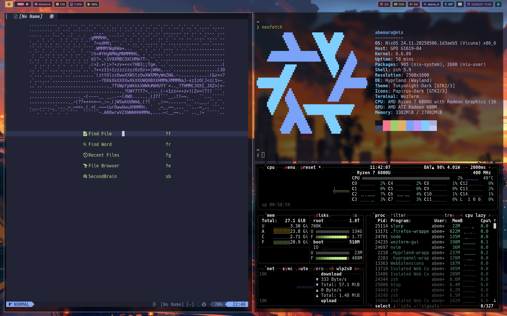

## dotfiles

My dotfiles for NixOS.



- terminal: [wezterm](https://wezterm.org/)
- shell prompt: [starship](https://starship.rs/)
- wm: [hyprland](https://hyprland.org/)
- editor: [Nixvim](https://github.com/nix-community/nixvim)

## Setup

```bash
$ sudo nixos-rebuild switch --flake .#gpd --show-trace
```

## Todo

- Hyprlockが起動時動かない
- KeyBindなど使いながらいい感じにしていきたい
